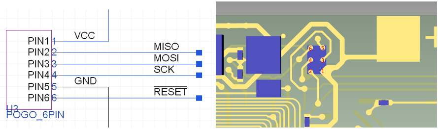

# A15 User Guide

### Introduction

The A15 is a flexible microcontroller, based on the Arduino Mini, and is compatible with many existing Arduino libaries and peripheral hardware.  Programming the devices is performed via the AVR In-System Programming (ISP) interface.  This interface is accessible via the SPI lines and RESET line of the device.

This guide is intended to provide some initial instructions for dev environment setup and programming.

## Hardware Interface

When using the A15, there are two hardware interfaces that can access the ISP lines:
 - 6-pin pogo-pin interface.
 - ZIF connector

Once programmed, power can be applied externally via the +/- pads. (e.g. using alligator clips to power a demo)

See the following image:


Left: ZIF connection. Center: POGO connection. Right: Power pads.

### ZIF Connection ###
The ZIF connection exposes all of the Atmega 328P pins, even more so than typical Arduino boards.  The numbering convention follows the following diagram:<br>


A table of the connections and their relationship to pin function is as follows:
| External Pads | Arduino Pin IDE | ZIF Connector (Flipped, Rigid) | PAD                        | EXTINT | PCINT   | ADC/AC | OSC  | T/C #0 | T/C #1 | USART0 | ISC0 | SPI0  |
| ------------- | --------------- | ------------------------------ | -------------------------- | ------ | ------- | ------ | ---- | ------ | ------ | ------ | ---- | ----- |
|               |                 | 1                              | PD\[6\]                    |        |         |        |      |        |        |        |      |       |
|               |                 | 2                              | PD\[7\]                    |        |         |        |      |        |        |        |      |       |
|               | 5               | 3                              | PD\[5\]                    |        | PCINT21 |        |      | OC0B   | T1     |        |      |       |
|               | 8               | 4                              | PB\[0\]                    |        | PCINT0  |        | CLK0 | OC2A   |        |        |      |       |
| LED           | 9               | 5                              | PB\[1\]                    |        | PCINT1  |        |      |        |        |        |      |       |
| LED           | 10              | 6                              | PB\[2\]                    |        | PCINT2  |        |      |        |        |        |      | ~SS0  |
| MOSI0         | 11              | 7                              | PB\[3\]                    |        | PCINT3  |        |      |        |        |        |      | MOSI0 |
| MISO0         | 12              | 8                              | PB\[4\]                    |        | PCINT4  |        |      |        |        |        |      | MISO0 |
| SCK0          | 13              | 9                              | PB\[5\]                    |        | PCINT5  |        |      |        |        |        |      | SCK0  |
|               | A6/20?          | 10                             | ADC6 (No connect in Ver 4) |        | ADC6    |        |      |        |        |        |      |
|               | A7/21?          | 11                             | ADC7                       |        |         | ADC7   |      |        |        |        |      |       |
|               | 14              | 12                             | PC\[0\]                    |        | PCINT8  | ADC0   |      |        |        |        |      |       |
|               | 15              | 13                             | PC\[1\]                    |        | PCINT9  | ADC1   |      |        |        |        |      |       |
|               | 16              | 14                             | PC\[2\]                    |        | PCINT10 | ADC2   |      |        |        |        |      |       |
|               | 17              | 15                             | PC\[3\]                    |        | PCINT11 | ADC3   |      |        |        |        |      |       |
|               | 18              | 16                             | PC\[4\]                    |        | PCINT12 | ADC4   |      |        |        |        | SDA0 |       |
|               | 19              | 17                             | PC\[5\]                    |        | PCINT13 | ADC5   |      |        |        |        | SCL0 |       |
|               | RESET           | 18                             | PC\[6\]/~RESET             |        | PCINT14 |        |      |        |        |        |      |       |
|               | 0               | 19                             | PD\[0\]                    |        | PCINT16 |        |      |        |        | RXD0   |      |       |
|               | 1               | 20                             | PD\[1\]                    |        | PCINT17 |        |      |        |        | TXD0   |      |       |
|               | 2               | 21                             | PD\[2\]                    | INT0   | PCINT18 |        |      |        |        |        |      |       |
|               | 3               | 22                             | PD\[3\]                    | INT1   | PCINT19 |        |      | OC2B   |        |        |      |       |
|               | 4               | 23                             | PD\[4\]                    |        | PCINT20 |        |      | T0     |        | XCK0   |      |       |
|               |                 | 24                             |                            |        |         |        |      |        |        |        |      |       |
|               |                 | 25-27                          | VCC                        |        |         |        |      |        |        |        |      |       |
|               |                 | 25-27                          | VCC                        |        |         |        |      |        |        |        |      |       |
|               |                 | 28-30                          | GND                        |        |         |        |      |        |        |        |      |       |
|               |                 | 28-30                          | GND                        |        |         |        |      |        |        |        |      |       |
|               | N/C             | N/C                            | PD\[6\]                    |        | PCINT22 | AIN0   |      | OC1A   |        |        |      |       |
|               | N/C             | N/C                            | PD\[7\]                    |        | PCINT23 | AIN1   |      | OC1B   |        |        |      |       |
|               |                 |                                | AVCC                       |        |         |        |      |        |        |        |      |       |
|               |                 |                                | AREF                       |        |         |        |      |        |        |        |      |       |
|               |                 |                                | GND                        |        |         |        |      |        |        |        |      |       |

__NOTE:__ To learn more about both of these connections, see the [A15 Technical Specification Guide](./A15v4-3%20Technical%20Specifications%20Release.pdf).

# Programming A15 with Arduino Uno Guide

Although there are dedicated ISP Programmers, a common and inexpensive method to use the interface is by using another Arduino.  The Arduino IDE provides integrated support for this method of device programming.

### Preperation - Configuring the Arduino UNO
Before an Arduino can be used as an ISP programmer, it must first be programmed with a translation program that communicates via serial on to the host interface and SPI to the target device.  Within the provided examples, Arduino has a sketch called *ArduinoISP*.


Insert the Arduino (for this example the UNO), configure the proper port/board setting, and upload the sketch.

 

### Step One - Connect The A15 Via A Programmer

Once setup, the Zero Insertion Force (ZIF) interface provides a convenient development environment that enables programming and device testing.  There is also a 6-pin pogo interface that we found more consistent for conductivity.

#### ZIF Interface

The A15 uses a 30-pin 0.5mm pitch ZIF interface.  An easy to use break-out board for development can be found, [here](https://www.amazon.com/gp/product/B07RWNFKCR/).  Other ZIF connectors should work well, though we have found a need to insert a spacer to make good contact with other connectors.


__NOTE:__ Most ZIF connectors have contacts only on the bottom requiring the user to place the A15 device face down in the connector.  If this is the case the pin mapping on the ZIF connector starts with the number one pin at the bottom of the connector. If a ZIF connector with contacts on both sides or the top of the connector is used, and the device is being placed face up in the connector the pin mapping on the ZIF connector should be reversed.

Once you have your A15 hooked up to a ZIF connector, you are ready to start connecting pins.

Connections:

* Arduino GND -> ZIF 30,29,28
* Arduino Vin -> ZIF 27,26,25
* Arduino 10 -> ZIF 18 (Reset)
* Arduino 11 -> ZIF 7 (MOSI)
* Arduino 12 -> ZIF 8 (MISO)
* Arduino 13 -> ZIF 9 (SCK)


#### 6-pin Pogo Interface
The secondary 6-pin POGO interface is useful for embedded devices where connection to the ZIF connector is not practical.  Source parts can be purchased from a variety of vendors, a fully assembled 6-pin connector can be found, [here](https://www.segger.com/products/debug-probes/j-link/accessories/adapters/6-pin-needle-adapter/).  An example of this interface can be seen in the following images:


The POGO connection, ZIF connection, and front facing pads connections are all SPI - thus they follow the same general guidelines.



Once you have successfully connected your programming interface, you are ready for the next step.

### Step Two - Load the NextFlex A15 Board into the Arduino IDE

In order to execute step 2 the Arduino IDE software must first be installed.  It is recommended to install the latest version using the offline installer instead of going through the Windows App store as the Windows App store version may lead to broken dependencies.

The IDE can be downloaded from:
[https://www.arduino.cc/en/Main/Software](https://www.arduino.cc/en/Main/Software)

Once the IDE is correctly installed the proper board settings must be set.

For convenience, we've created an Arduino Board package.  To install the NextFlex A15 package, perform the following.

In Arduino, navigate to Files > Preferences > Additional Boards Manager URLSs.
Paste the following URL to the open space: ```https://raw.githubusercontent.com/rmcmanus-nf/a15/master/package_A15_index.json```


This is the link to a JSON that will allow Arduino to install the necessary files for the A15 bootloader.
Now, navigate to Tools > Board: > Boards Manager... In the top search bar, search for "A15". You should see the following option:


Your dropdown window should now show the NextFlex A15 under the list of available boards.


Congratulations! You have added the NextFlex A15 Board into the Arduino IDE.

### Step Three - Upload A Program

Once you have selected the NextFlex A15 Board, you are ready to upload a program. Connect the USB for the Arduino you are using as a programmer (in this example and Arduino UNO is used) to the USB port of the computer on which you are running the IDE.  If you are using an Arduino to program via the ISP, you will need to specify the port of the connected Arduino, and the programmer as *Arduino as ISP*, as shown here:


Connect the USB for the Arduino you are using as a programmer (in this example and Arduino UNO is used) to the USB port of the computer on which you are running the IDE.  

Create a new Sketch, paste the following code in Arduino:

```cpp
void setup() {
  pinMode(LED_BUILTIN, OUTPUT);
  pinMode(9, OUTPUT);
  pinMode(10, OUTPUT);
}

void loop() {
  digitalWrite(LED_BUILTIN, HIGH);  
  digitalWrite(9, HIGH);
  digitalWrite(10, LOW);
  delay(1000);                    
  digitalWrite(LED_BUILTIN, LOW);  
  digitalWrite(9, LOW);
  digitalWrite(10, HIGH);  
  delay(1000);                
}
```

To upload, navigate to *Sketch > Upload Using Programmer*.  Do NOT use the *Upload* button or icon.
Your Arduino should blink its LEDs. 


Congratulations, you have uploaded a program to the A15!
